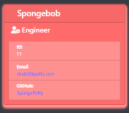
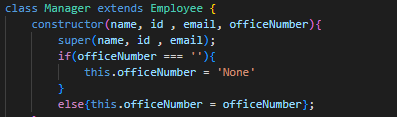

# Team Profile Generator-OOP

The goal of this application is to allow the user to input new team members and assign them each certain
values such as id and email. Then take them information and print it to an html page
showing a card for each employee displaying that information. (As seen bellow)



---

## Demo

Here is a short demonstration of the apps functionality from start to finish:


---

## Installation

To install the project in terminal run this command:

```bash
  git clone git@github.com:fiaschettima/teamProfileGenerator-OOP.git
  ...

```
    
## Usage/Examples

To use the application 
```javascript
    cd teamProfileGenerator-OOP
    node index.js
```
This will Initialize the application and begind prompts.

---

## Code Snippets

The code displayed below is an example of a class with a constructor function. The constructor functions is an
'extension' of the employee class. So the Manager class is able to call on any methods available to the employee.



---

## Tech Stack

**Client:** BootStrap, CSS, HTML

**Server:** Node, Express, Inquirer, Path

---

## Lessons Learned

This project provided the oppurtunity to gain a better understanding of writing tests for code and writing code to pass the given test. Also, practice with object class constructors to create the employees.

---

## License

[MIT](https://choosealicense.com/licenses/mit/)

---

## Badges

[](https://github.com/tterb/atomic-design-ui/blob/master/LICENSEs)

---

## Authors

- [@Matt Fiaschetti](https://github.com/fiaschettima)

